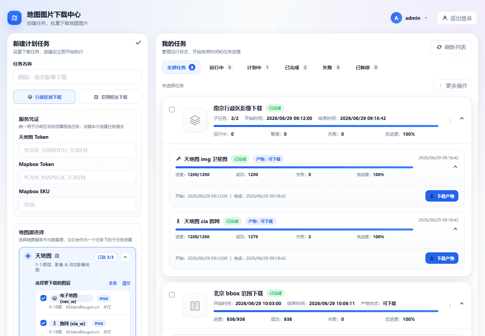
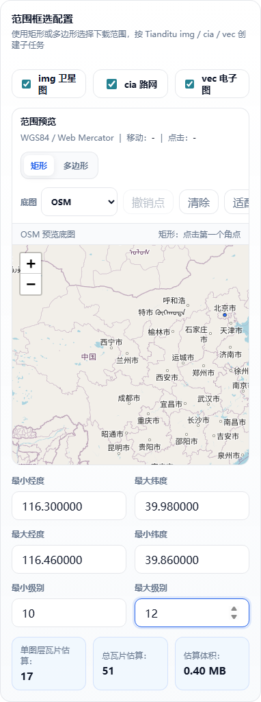
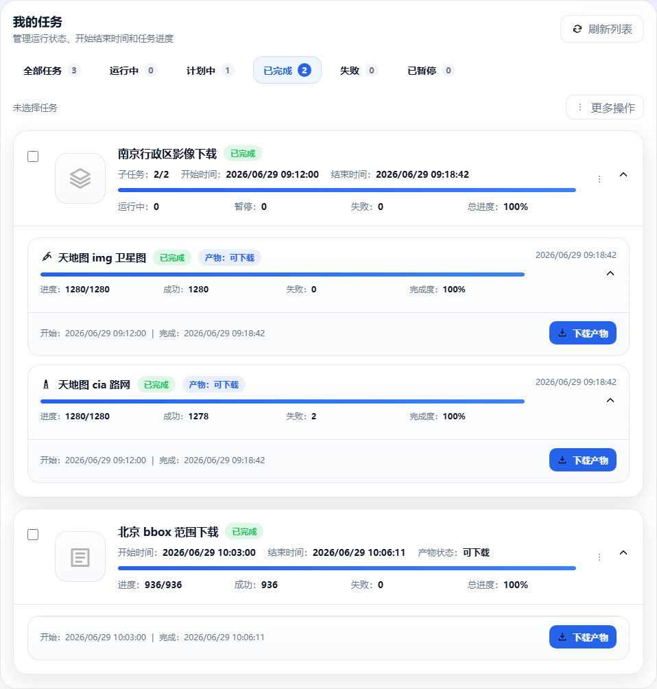

# Map Tile Fetcher

**中文**：一个自托管的地图瓦片下载 Web 工具，用 Go + SQLite + Leaflet 提供浏览器界面，支持框选范围、GeoJSON/行政区划、多地图源、任务进度和 ZIP/MBTiles 导出。

**English**: A self-hosted Go Web app for downloading authorized map tiles by bounding box or GeoJSON/admin regions, with task progress, failure records, retries, and ZIP/MBTiles exports.

> **合规提醒 / Compliance**：请只用于你有权访问和下载的地图瓦片服务。Use this tool only with map tile services that you are authorized to access and download. The project does not grant permission to bypass third-party terms, quotas, or access controls.



- [中文说明](#中文说明)
- [English Guide](#english-guide)

## 中文说明

### 核心能力

- **框选范围下载**：在 Leaflet 地图上框选 bbox，设置 zoom 和图层后创建任务。
- **行政区划/GeoJSON 下载**：按内置区域目录或 GeoJSON 层级创建下载计划。
- **多地图源配置**：支持天地图、Mapbox、OSM、Google 样例和自定义瓦片 URL。
- **任务和产物管理**：独立任务页查看历史、进度、失败记录，并下载 ZIP/MBTiles。
- **资源限制和排队**：默认每父任务全部图层合计最多 100 万瓦片，同时运行最多 3 个子任务，其余持久排队；暂停任务继续占用执行槽。
- **完整重试和安全删除**：按任务及运行隔离产物，补齐失败瓦片后发布累计结果，删除时清理任务记录及生成文件。
- **任务区域预览**：独立展示完整区域、切换层级，自动续期预览凭证；支持移动端创建和任务操作。

### 适合谁

- 需要在内网、个人服务器或项目服务器上自托管瓦片下载工具的 GIS/地图开发者。
- 需要把授权地图源按 bbox、行政区划或 GeoJSON 范围批量转成离线包的人。
- 需要 ZIP 文件树或 MBTiles 产物，用于离线地图、测试数据或内部制图流程的团队。

### 三分钟启动

源码运行需要 Go 1.25 或更高版本。在仓库应用目录启动，确保能读取 `conf.toml`、`static/` 和 `geojson/`：

```powershell
git clone https://github.com/Joe5027/map-tile-fetcher.git
cd map-tile-fetcher\apps\admin-region-tiler
go run .
```

打开 `http://127.0.0.1:8081/`。

开发默认账号：

- 用户名：`admin`
- 密码：`adminmap`

首次用于生产前，保持登录启用并设置自己的初始账号和密码。源码或二进制启动读取
`conf.toml` 和进程环境变量（如 `AUTH_DEFAULT_USERNAME`、`AUTH_DEFAULT_PASSWORD`），
不会自动加载 `.env`；Docker Compose 和下方 `docker run --env-file .env` 才会注入该文件。
这些账号配置用于初始化用户，修改配置不会重置数据库中已有同名用户的密码。
已有用户可在账号菜单修改密码，或由维护者使用离线恢复命令；详见
[密码修改与离线恢复](docs/password-recovery.md)。

### Docker 镜像和部署

如果你要从源码构建镜像，需要 Dockerfile。本仓库已经提供：

- `apps/admin-region-tiler/Dockerfile`
- `apps/admin-region-tiler/docker-compose.yml`
- `apps/admin-region-tiler/.dockerignore`

推荐用 Docker Compose：

```powershell
cd apps\admin-region-tiler
Copy-Item .env.example .env
notepad .env
docker compose up --build -d
docker compose ps
```

打开 `http://127.0.0.1:8081/`。

手动构建并运行镜像：

```powershell
cd apps\admin-region-tiler
Copy-Item .env.example .env
docker build -t map-tile-fetcher:latest .
docker run --rm --name map-tile-fetcher `
  -p 8081:8081 `
  --env-file .env `
  -v "${PWD}\data:/app/data" `
  -v "${PWD}\output:/app/output" `
  -v "${PWD}\geojson:/app/geojson" `
  -v "${PWD}\conf.toml:/app/conf.toml:ro" `
  map-tile-fetcher:latest
```

Docker 配置项：

| 配置 | 默认值 | 说明 |
| --- | --- | --- |
| `HOST_PORT` | `8081` | 宿主机暴露端口，浏览器访问这个端口。 |
| `APP_PORT` | `8081` | 容器内应用监听端口，通常不用改。 |
| `APP_DATABASE` | `tiler.db` | SQLite 数据库文件名，保存在 `data/`。 |
| `AUTH_DEFAULT_USERNAME` | `admin` | 默认登录用户名，生产部署必须修改。 |
| `AUTH_DEFAULT_PASSWORD` | `adminmap` | 默认登录密码，生产部署必须修改。 |
| `TASK_MAX_TILES` | `1000000` | 每父任务所有图层累计瓦片预算；区域按包围范围保守估算。 |
| `TASK_MAX_ACTIVE` | `3` | 同时运行的子任务上限，暂停任务继续占槽，其余排队。 |
| `TASK_WORKERS` | `3` | 默认请求线程数；用户可选 1～50，受地图来源并发上限约束。 |
| `TZ` | `Asia/Shanghai` | 容器时区。 |

Compose 会持久化 `data/`、`output/`、`geojson/` 和 `conf.toml`。如果端口被占用，把 `.env` 里的 `HOST_PORT=8081` 改成其他端口，例如 `HOST_PORT=18081`。

### 使用流程



1. 登录后进入 `新建计划` Tab。
2. 选择 `行政区划下载` 或 `范围框选下载`。
3. 输入你有权使用的服务 token，或选择不需要 token 的自定义地图源。
4. 设置线程、请求间隔、产物格式和执行时间。
5. 创建任务后自动进入 `我的任务` Tab。



`我的任务` Tab 展示排队状态、本次运行进度、累计完整度、未解决失败数和产物入口。
实际线程数取用户设置与来源 `worker_count` 上限的较小值；请求间隔不低于用户设置
和来源最低间隔，页面显示生效参数。

### 重试、删除和历史任务

- **失败重试**：先复制旧成功结果到新运行，再补齐未解决瓦片，重新生成累计 ZIP/MBTiles。
  同名任务及重复运行互不覆盖；新产物发布成功前继续提供上一份可用下载，失败或取消不切换入口。
  重试仍有失败时会显示缺口，不会标为全部成功。
- **彻底删除**：删除父任务会清理所有子任务、历史运行、产物及关联记录；内置区域文件和仍被
  其他任务引用的区域文件受保护。运行、暂停或打包中的任务需先取消并等待结束；清理失败可重试。
- **历史核对**：通过显式核对动作检查本地文件树、ZIP 或 MBTiles，不自动下载瓦片。
  旧成功瓦片缺失时，失败重试返回 `409 baseline_missing`，需主动选择“重新创建完整任务”。

升级前备份数据库和输出，并先用隔离副本验证。迁移方式、磁盘空间要求和各项回归证据见
[修复验收记录](docs/repair-acceptance-2026-09-11.md)。

### 配置地图源

示例配置在 `apps/admin-region-tiler/conf.toml`。

安全占位符：

- `YOUR_TIANDITU_TOKEN`
- `YOUR_MAPBOX_TOKEN`
- `YOUR_MAPBOX_SKU`

真实 token 只应保存在本地 `.env`、本地配置或部署平台的密钥管理中，不要提交到 Git。

### 发布和安装

当前源码的 Windows/Linux 开发验证包统一由
[`scripts/build_release.py`](apps/admin-region-tiler/scripts/build_release.py) 生成，
命令、构建身份及安装验收见 [构建与安装](docs/build-and-install.md)。
页面、`tiler --version` 和 `/api/version` 显示实际构建版本；本轮不新增发布标签。

- 已发布预览版：[`v0.3.0`](https://github.com/Joe5027/map-tile-fetcher/releases/tag/v0.3.0)（发布说明及下载包）
- 历史发布说明：[`docs/releases/v0.1.0.md`](docs/releases/v0.1.0.md)
- 用户手册：[`docs/user-manual-zh.md`](docs/user-manual-zh.md)
- English manual: [`docs/user-manual.md`](docs/user-manual.md)

本 README 描述当前 `main` 的行为；上述预览版早于本次修复，不包含全部新行为。
需要本次修复时，请使用当前 `main` 源码运行或构建 Docker 镜像。

如果使用二进制发布包，解压后保持 `conf.toml`、`static/`、`geojson/` 和可执行文件在同一目录，再启动程序。

### 开发验证

在应用目录执行 `go test ./...`、`go vet ./...` 和 `node scripts/release_preflight.mjs`。
浏览器检查需要 Node.js、Playwright 及 Chromium；命令示例见下方 [Developer Validation](#developer-validation)。
Go 集成测试贯通真实 API、临时 SQLite、正常工作进程与本地模拟瓦片服务，检查任务控制和最终产物。
发布预检还覆盖渲染安全、390/768/1440px 页面、预览续期和登录失效后的重新登录；
Linux CI 额外执行 `go test -race ./...`。详见 [验证链路](docs/validation-chain.md)。

## English Guide

### What It Does

Map Tile Fetcher is a self-hosted Go Web app for downloading authorized map tiles and packaging them for offline use.

- **Bounding-box downloads**: draw a bbox on a Leaflet map, choose zoom levels and layers, then create a task.
- **GeoJSON/admin-region downloads**: create tasks from built-in region catalogs or GeoJSON files.
- **Configurable map sources**: Tianditu, Mapbox, OSM, Google examples, and custom tile URLs.
- **Task and artifact management**: view task history, progress, failures, retries, and download ZIP/MBTiles artifacts.
- **Resource limits and queues**: by default, each parent task has a combined budget of 1,000,000 tiles across all layers. Up to three children run at once; others remain in a persistent queue. Paused children retain their slots.
- **Cumulative retries and safe deletion**: isolate artifacts by task and run, publish cumulative results after retrying failed tiles, and delete task records together with generated files.
- **Task area previews**: view complete areas on an independent overlay, switch levels, and renew preview credentials automatically; create and manage tasks on mobile screens.

### Who It Is For

- GIS or map developers who need a self-hosted tile downloader.
- Teams that need authorized tiles exported by bbox, admin region, or GeoJSON area.
- Projects that need ZIP file trees or MBTiles artifacts for offline maps, internal workflows, or test data.

### Quick Start

Source builds require Go 1.25 or later. Start in the application directory so the app can read `conf.toml`, `static/`, and `geojson/`:

```powershell
git clone https://github.com/Joe5027/map-tile-fetcher.git
cd map-tile-fetcher\apps\admin-region-tiler
go run .
```

Open `http://127.0.0.1:8081/`.

Development login:

- Username: `admin`
- Password: `adminmap`

Before first production use, keep login enabled and set your own initial credentials.
Source and binary runs read `conf.toml` and process environment variables such as
`AUTH_DEFAULT_USERNAME` and `AUTH_DEFAULT_PASSWORD`; they do not load `.env` automatically.
Docker Compose and the `docker run --env-file .env` command below inject that file.
These settings initialize users; changing them does not reset an existing user's password.
Existing users can change their password from the account menu. Maintainers can use
`tiler admin reset-password --database PATH --username NAME` after stopping all runtime
processes. The command prompts privately, backs up the existing database and revokes sessions.

### Docker Image And Deployment

If you build the image from source, you need a Dockerfile. This repository already includes one, so users do not need to write it manually:

- `apps/admin-region-tiler/Dockerfile`
- `apps/admin-region-tiler/docker-compose.yml`
- `apps/admin-region-tiler/.dockerignore`

Recommended Docker Compose workflow:

```powershell
cd apps\admin-region-tiler
Copy-Item .env.example .env
notepad .env
docker compose up --build -d
docker compose ps
```

Open `http://127.0.0.1:8081/`.

Manual image build and run:

```powershell
cd apps\admin-region-tiler
Copy-Item .env.example .env
docker build -t map-tile-fetcher:latest .
docker run --rm --name map-tile-fetcher `
  -p 8081:8081 `
  --env-file .env `
  -v "${PWD}\data:/app/data" `
  -v "${PWD}\output:/app/output" `
  -v "${PWD}\geojson:/app/geojson" `
  -v "${PWD}\conf.toml:/app/conf.toml:ro" `
  map-tile-fetcher:latest
```

On Linux/macOS, use POSIX-style mounts:

```bash
-v "$PWD/data:/app/data"
-v "$PWD/output:/app/output"
-v "$PWD/geojson:/app/geojson"
-v "$PWD/conf.toml:/app/conf.toml:ro"
```

Docker environment variables:

| Variable | Default | Description |
| --- | --- | --- |
| `HOST_PORT` | `8081` | Host port exposed by Docker Compose. |
| `APP_PORT` | `8081` | App port inside the container. |
| `APP_DATABASE` | `tiler.db` | SQLite database file stored under `data/`. |
| `AUTH_DEFAULT_USERNAME` | `admin` | Default login username. Change it for production. |
| `AUTH_DEFAULT_PASSWORD` | `adminmap` | Default login password. Change it for production. |
| `TASK_MAX_TILES` | `1000000` | Combined tile budget per parent across all layers; regions use a conservative bounding-range estimate. |
| `TASK_MAX_ACTIVE` | `3` | Maximum running children. Paused children retain slots; others queue. |
| `TASK_WORKERS` | `3` | Default request concurrency. Users can choose 1-50, subject to the source concurrency cap. |
| `TZ` | `Asia/Shanghai` | Container timezone. |

Docker Compose persists `data/`, `output/`, `geojson/`, and `conf.toml`. If port `8081` is already in use, change `HOST_PORT=8081` in `.env`, for example to `HOST_PORT=18081`.

### Usage Flow

1. Open the `Create Task` tab.
2. Choose `Admin Region` or `Bounding Box`.
3. Enter only tokens for services that you are authorized to use, or choose a custom source that does not need a token.
4. Set concurrency, request interval, artifact format, and schedule.
5. After task creation, switch to the `My Tasks` tab to track progress and download artifacts.

The task view separates queue status, current-run progress, cumulative completeness,
unresolved failures, and published downloads. Effective concurrency is the smaller
of the requested value and the source's `worker_count` cap. The request interval
is at least both the user setting and the source minimum; the UI shows the effective values.

### Retries, Deletion, And Legacy Tasks

- **Retry failures**: copy previously successful tiles into a new run, fetch unresolved tiles,
  then rebuild cumulative ZIP/MBTiles output. Identically named tasks and repeated runs do not
  overwrite one another. The previous download remains available until publication succeeds;
  failure or cancellation does not switch it. Remaining failures are reported as gaps.
- **Delete permanently**: deleting a parent removes its children, historical runs, artifacts,
  and related records. Built-in area files and files still referenced by other tasks are protected.
  Cancel running, paused, or packing tasks and wait for them to stop before deletion. Failed cleanup can be retried.
- **Reconcile legacy output**: explicitly check existing file trees, ZIPs, or MBTiles without
  downloading tiles. When previously successful tiles are missing, retries return
  `409 baseline_missing`; use the explicit full-task recreation action to download again.

Back up the database and output before upgrading and validate an isolated copy first.
See the [repair acceptance record](docs/repair-acceptance-2026-09-11.md) for migration,
disk-space requirements, and regression evidence.

### Map Source Configuration

Example map-source configuration lives in `apps/admin-region-tiler/conf.toml`.

Safe placeholders:

- `YOUR_TIANDITU_TOKEN`
- `YOUR_MAPBOX_TOKEN`
- `YOUR_MAPBOX_SKU`

Real tokens should stay in local `.env`, local config, or your deployment secret manager. Do not commit real tokens to Git.

### Release And Install

Use [`scripts/build_release.py`](apps/admin-region-tiler/scripts/build_release.py) for
Windows/Linux verification packages. See [Build and Install](docs/build-and-install.md).
The UI, `tiler --version` and `/api/version` share the actual build identity.

- Published preview: [`v0.3.0`](https://github.com/Joe5027/map-tile-fetcher/releases/tag/v0.3.0) (release notes and downloads)
- Historical release notes: [`docs/releases/v0.1.0.md`](docs/releases/v0.1.0.md)
- Chinese manual: [`docs/user-manual-zh.md`](docs/user-manual-zh.md)
- English manual: [`docs/user-manual.md`](docs/user-manual.md)

This README describes the current `main` branch. The preview above predates these repairs
and does not include all current behavior. Run or build a Docker image from current `main`
to use the repairs.

For binary release packages, keep the executable, `conf.toml`, `static/`, and `geojson/` in the same directory before starting the app.

### Developer Validation

In addition to Go, browser checks require Node.js, Playwright, and Chromium.
Install them once if they are not already available:

```powershell
npm install -g playwright
npx playwright install chromium
```

Then run:

```powershell
cd apps\admin-region-tiler
go test ./...
go vet ./...
node --check .\static\script.js
node .\scripts\release_preflight.mjs
```

Go integration tests exercise real APIs, temporary SQLite databases, ordinary worker
processes, and a local tile fixture, including task controls and final artifact checks.
The release preflight also runs JavaScript checks, rendering-security contracts,
browser smoke and regressions at 390/768/1440px, preview renewal, re-login after session
expiry, sensitive-value scanning, and tracked generated-file scanning.
Linux CI additionally runs `go test -race ./...` and `go vet ./...`.
See the [validation chain](docs/validation-chain.md) for the full workflow.

## Repository Notes

The old .NET range downloader runtime has been retired. Its bbox workflow has been ported into the Go app under `apps/admin-region-tiler`; historical notes are kept in [`docs/range-migration.md`](docs/range-migration.md).

## License

Apache License 2.0. See [`LICENSE`](LICENSE).
