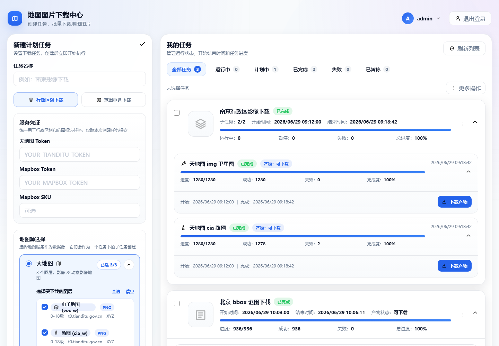
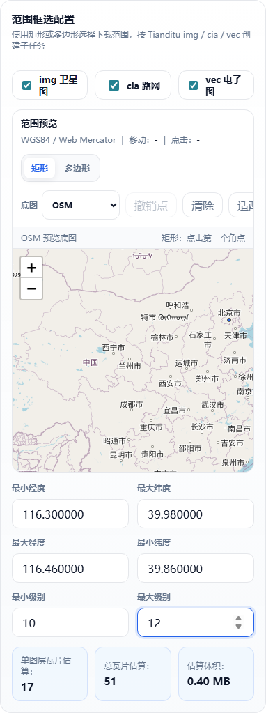
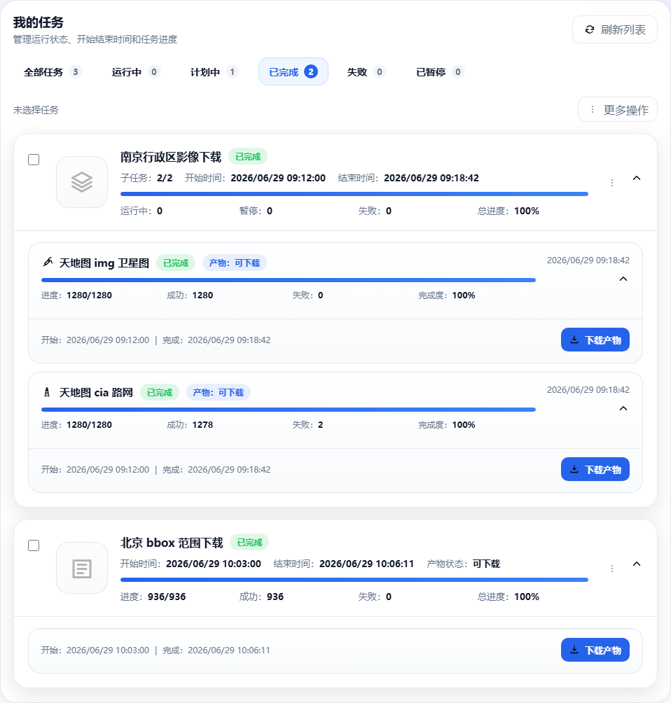

# Map Tile Fetcher

一个自托管的 Go Web 地图瓦片下载工具，支持按地图框选范围或
GeoJSON/行政区划创建下载任务，并导出 ZIP 文件树或 MBTiles。

> 请只用于你有权访问和下载的地图瓦片服务。项目提供限速、重试和本地
> token 配置能力，但不会授权绕过任何第三方服务条款、配额或访问限制。



## 适合谁

- 需要在内网或自己的服务器上运行地图瓦片下载工具的 GIS/地图开发者。
- 需要按矩形 bbox、行政区划或 GeoJSON 范围批量生成离线瓦片的人。
- 需要把授权地图源导出为 ZIP 文件树或 MBTiles 的项目维护者。
- 想要一个 Go + SQLite + 静态 Web UI 的轻量自托管方案的团队。

## 核心能力

- **范围框选下载**：在 Leaflet 地图上框选 bbox，自动估算瓦片数量和体积。
- **行政区划/GeoJSON 下载**：按内置区域目录或 GeoJSON 层级创建任务。
- **多地图源配置**：支持天地图、Mapbox、OSM、Google 样例和自定义瓦片 URL。
- **任务和产物管理**：查看进度、失败记录、重试失败瓦片，并下载 ZIP/MBTiles。

## 三分钟启动

```powershell
git clone https://github.com/Joe5027/map-tile-fetcher.git
cd map-tile-fetcher\apps\admin-region-tiler
go run .
```

打开 `http://127.0.0.1:8081/`。

开发默认账号：

- 用户名：`admin`
- 密码：`adminmap`

生产部署时请复制 `.env.example` 为 `.env`，并修改默认账号和密码。

## Docker 启动

```powershell
cd apps\admin-region-tiler
Copy-Item .env.example .env
docker compose up --build
```

默认端口是 `8081`。可以在 `.env` 中调整 `HOST_PORT`、`APP_PORT`、
`APP_DATABASE`、`AUTH_DEFAULT_USERNAME` 和 `AUTH_DEFAULT_PASSWORD`。

## 使用流程

### 1. 范围框选下载



1. 登录后选择“范围框选下载”。
2. 输入授权服务的 token，或选择不需要 token 的自定义地图源。
3. 在地图上框选范围，设置最小/最大 zoom。
4. 选择 ZIP 文件树或 MBTiles，创建任务。

### 2. 任务和产物下载



任务完成后可以在任务列表中查看成功数、失败数、产物状态，并下载生成的
ZIP 或 MBTiles。失败记录会持久化，便于调整并发、请求间隔或代理后重试。

## 配置地图源

示例配置在 `apps/admin-region-tiler/conf.toml`。

安全占位符：

- `YOUR_TIANDITU_TOKEN`
- `YOUR_MAPBOX_TOKEN`
- `YOUR_MAPBOX_SKU`

真实 token 只应保存在本地 `.env`、本地配置或部署平台的密钥管理中，不要提交到 Git。

## 发布和安装

- 发布说明：[`docs/releases/v0.1.0.md`](docs/releases/v0.1.0.md)
- 中文用户手册：[`docs/user-manual-zh.md`](docs/user-manual-zh.md)
- English manual: [`docs/user-manual.md`](docs/user-manual.md)

当前仓库可通过源码或 Docker 直接运行。GitHub Release 创建后，`v0.1.0`
会提供 Windows 和 Linux 二进制资产。

## 开发者验证

```powershell
cd apps\admin-region-tiler
node .\scripts\release_preflight.mjs
```

发布预检会运行 Go 测试、JavaScript 检查、浏览器 UI 冒烟、敏感值扫描和
tracked 生成物扫描。

## 项目历史

旧 .NET 范围下载器运行代码已退休。bbox 框选流程已经迁移到
`apps/admin-region-tiler` 的 Go Web 应用中；历史说明见
[`docs/range-migration.md`](docs/range-migration.md)。

## 许可证

Apache License 2.0。详见 [`LICENSE`](LICENSE)。
