# Knowledge Graph

This graph captures durable relationships future AI sessions should recover
before making release, cleanup, or validation decisions.

```mermaid
graph TD
  U["User operating style"] --> OC["Global operator charter"]
  OC --> WC["Workspace contract"]
  WC --> AG["AGENTS.md"]
  WC --> PM["docs/project-map.md"]
  WC --> DD["docs/done-definition.md"]
  WC --> AOH["docs/ai-operating-handbook.md"]
  WC --> LS[".codex/skills/two-projects-handoff"]

  Repo["Map Tile Fetcher repo"] --> Manifest["PROJECT_MANIFEST.md"]
  Repo --> Readme["README.md"]
  Repo --> License["Apache License 2.0"]
  Repo --> Merge["docs/merge-plan.md"]
  Repo --> AT["apps/admin-region-tiler"]
  Repo --> RangeNote["docs/range-migration.md"]

  RangeNote --> RangeFlow["Ported bbox range workflow"]

  AT --> ATServer["server.go Gin API"]
  AT --> ATRuntime["runtime.go scheduler and workers"]
  AT --> ATTask["task.go tile engine"]
  AT --> ATDB["db.go SQLite state"]
  AT --> ATUI["static unified UI"]
  AT --> ATGeo["geojson region resources"]
  AT --> ATDeploy["Docker, Nginx, systemd deploy assets"]

  Merge --> Base["Single Go backend"]
  Base --> Contracts["Task, area, source, artifact, failure contracts"]
  RangeFlow --> Contracts

  DD --> VAdmin["go test ./..."]
  DD --> VNode["node --check changed JS"]
  DD --> VSecrets["sensitive-value scan"]
  DD --> VHandoff["handoff validator"]
  AOH --> VChain["docs/validation-chain.md"]
  AOH --> KG["docs/knowledge-graph.md"]
  AOH --> LTM["docs/long-term-memory.md"]

  Auto["docs/automation-guardrails.md"] --> ReadOnly["Read-only recurring reviews"]
  ReadOnly --> Report["Facts / Checks / Risk / Next Action"]
```

## Relationship Notes

- The global charter authorizes proactive workspace improvement, but project
  facts belong in this repository, not in global `.codex` docs.
- `docs/ai-operating-handbook.md` is the compact route for repository-local AI
  enhancement and control-surface work.
- `docs/project-map.md` is the first durable context packet for future sessions.
- `docs/long-term-memory.md` carries restart-ready state for long-running merge
  or cleanup work, including AI-control tranches.
- `apps/admin-region-tiler` is the single runtime application.
- The old .NET range downloader is represented only by
  `docs/range-migration.md`.
- Validation is Go and frontend-script specific. Do not replace `go test` or
  changed-JS `node --check` with generic prose review when the commands can run.
