# Knowledge Graph

This graph captures the durable relationships future AI sessions should recover
before making merge, release, or validation decisions.

```mermaid
graph TD
  U["User operating style"] --> OC["Global operator charter"]
  OC --> WC["Workspace contract"]
  WC --> AG["AGENTS.md"]
  WC --> PM["docs/project-map.md"]
  WC --> DD["docs/done-definition.md"]
  WC --> LS[".codex/skills/two-projects-handoff"]

  Repo["two-projects GitHub handoff repo"] --> Manifest["PROJECT_MANIFEST.md"]
  Repo --> Readme["README.md"]
  Repo --> License["Apache License 2.0"]
  Repo --> Merge["docs/merge-plan.md"]
  Repo --> RD["apps/range-downloader"]
  Repo --> AT["apps/admin-region-tiler"]

  RD --> RDAPI["Program.cs minimal API"]
  RD --> RDUI["wwwroot range UI"]
  RDAPI --> RDJobs["TileDownloadManager and layer jobs"]
  RDUI --> RDFlow["Bounding-box selection and layer retry UX"]

  AT --> ATServer["server.go Gin API"]
  AT --> ATRuntime["runtime.go scheduler and workers"]
  AT --> ATTask["task.go tile engine"]
  AT --> ATDB["db.go SQLite state"]
  AT --> ATUI["static admin UI"]
  AT --> ATGeo["geojson region resources"]
  AT --> ATDeploy["Docker, Nginx, systemd deploy assets"]

  Merge --> Base["Use admin-region-tiler as backend base"]
  Merge --> RangeRef["Use range-downloader as range UX reference"]
  Base --> Contracts["Define shared task, area, source, artifact contracts"]
  RangeRef --> Contracts

  DD --> VRange["dotnet Release build"]
  DD --> VAdmin["go test ./..."]
  DD --> VNode["node --check changed JS"]
  DD --> VSecrets["sensitive-value scan"]
  DD --> VHandoff["handoff validator"]

  Auto["docs/automation-guardrails.md"] --> ReadOnly["Read-only recurring reviews"]
  ReadOnly --> Report["Facts / Checks / Risk / Next Action"]
```

## Relationship Notes

- The global charter authorizes proactive workspace improvement, but project
  facts belong in this repository, not in global `.codex` docs.
- `docs/project-map.md` is the first durable context packet for future sessions.
- `docs/long-term-memory.md` carries restart-ready state for long-running merge
  or environment-upgrade work.
- `apps/admin-region-tiler` has the stronger long-term backend base.
- `apps/range-downloader` has the clearer bounding-box user flow.
- Validation is app-specific. Do not replace `dotnet build`, `go test`, or
  changed-JS `node --check` with generic prose review when the commands can run.
